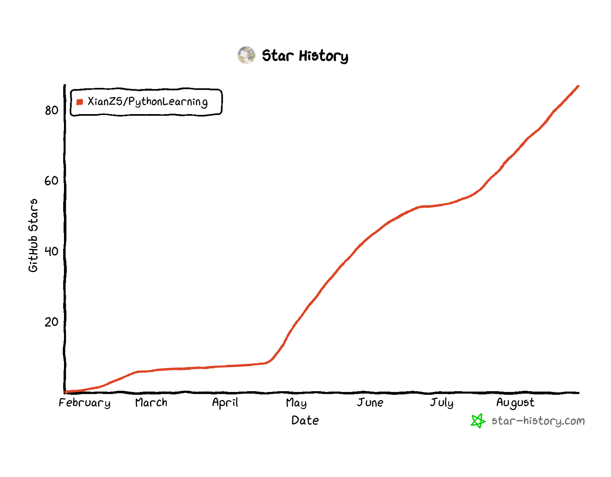

# PythonLearning-2026

## ✨ Key highlights（关键亮点）

> A comprehensive Python learning repository! Welcome!
>
> 这是一个包含了“基础”、“进阶”、“标准库”、“实战”和“八股文”的`python`学习仓库。

> Free Teaching Videos:（最新教学视频-完全免费）。
>
> https://space.bilibili.com/3690991649294439/lists/7284550
>
> https://xianzs.github.io/

## 🧪 学习路线

- 1.<font color="red">（必选-已完成更新）</font>`Python基础学习`：`./python_basic_learning/`
- 2.<font color="red">（必选-已完成更新）</font>`Python进阶学习`：`./python_advance_learning/`
- 3.<font color="red">（必选-已完成更新）</font>`Python标准库学习`：`./python_stdlib_learning/`
- 4.<font color="red">（可选-正在更新）</font>`Python小Demo实现`：`./python_demo_learning/`
- 5.<font color="red">（必选-正在更新）</font>`Python项目-RAG`：`./python_practical_project/`
- 6.<font color="red">（必选-正在更新）</font>`Python八股文`：`./python_common_interview_questions_and_answers/`

## 🚀 Get Started Quickly（快速上手）

You need to make sure that the git tool has been installed on your computer.

```
## 1.use git tool
git clone https://github.com/XianZS/PythonLearning
## 2.Configuration Environment (either-or)
cd PythonLearning
### 2.1 if you use conda
conda env create -f environment.yml
### 2.2 if you use pip
pip install -r requirements.txt
## 3.Export environment
conda env export > environment.yml
pip freeze > requirements.txt
```

## 💬 Feedback exchange（交流反馈）

Welcome everyone's participation in the discussion. Thank you.（欢迎各位的交流，谢谢。）

`Email`:`xianzhisen_yang@outlook.com`

`QQ`:`3135989009`

## 📂 Module Order / Complete Directory Structure（项目架构）

```
PythonLearning/
├── Python Basic Learning Section/ [python 基础学习]
│   ├── 1. Getting Started Guide (Icebreaker)
│   ├── 2. Variables and Data Types
│   ├── 3. Operators and Expressions
│   ├── 4. Flow Control (Core Foundation)
│   ├── 5. Function Basics
│   ├── 6. Data Structures (List/Tuple/Dictionary/Set)
│   ├── 7. File Operations
│   ├── 8. Exception Handling
│   └── 9. Basic Comprehensive Practical Project
├── Python Advanced Learning Section/ [python 进阶学习]
│   ├── 1. Advanced Functions
│   ├── 2. Object-Oriented Programming (OOP)
│   ├── 3. Modularization and Package Management
│   ├── 4. Basic Data Processing (Connecting Standard Libraries/Third-Party Libraries)
│   ├── 5. Basic Network Programming
│   ├── 6. Database Programming
│   ├── 7. Introduction to Concurrent Programming
│   ├── 8. Advanced Comprehensive Practical Projects (2 Projects, Covering Multiple Modules)
│   └── 9. Advanced Stage Review and Direction Guidance
└── Python Standard Library Learning Section/ [python 标准库学习]
    ├── 1. File and Directory Operations
    ├── 2. Data Processing and Formats
    ├── 3. System Interaction and Processes
    ├── 4. Text Processing
    ├── 5. Date and Time
    ├── 6. Mathematics and Scientific Computing
    ├── 7. Concurrency and Asynchrony
    ├── 8. Debugging and Testing
    ├── 9. Network Communication
    └── 10. Encryption and Security
```

## 📖 document description（学习文档详细描述）

### 1.1 Python Basic Learning Section

| Module Order                         | Core Content                                                 |
| ------------------------------------ | ------------------------------------------------------------ |
| 1. Getting Started Guide (Icebreaker) | ① What is Python/What can it do (Visual demonstration of application scenarios such as web crawling, data analysis, automation, etc.);<br />② Environment Setup (Adapted for Windows/Mac/Linux systems, Anaconda+PyCharm installation, solving the pain point of "installation errors");<br />③ First Program (Hello World + personalized modification, such as outputting your own name to enhance sense of involvement) |
| 2. Variables and Data Types          | ① Variable Definition (Naming rules + taboos, pitfalls to avoid: Chinese variables, keyword naming);<br />② Basic Data Types (int/float/str/bool, each type with 2 life-oriented cases: e.g., str for processing names, int for calculating salaries);<br />③ Type Conversion (Forced conversion + automatic conversion, error-prone point: format issues when converting str to int);<br />④ Practical Exercise: Record personal information (name, age, salary) and print it |
| 3. Operators and Expressions         | ① Arithmetic Operators (+/-/*//%**, cases: calculating shopping discounts, simplified version of salary tax calculation);<br />② Assignment Operators (=/:=, etc., pitfall to avoid: priority of chained assignment);<br />③ Comparison Operators (==/!=/>/<, case: judging whether a score is passing);<br />④ Logical Operators (and/or/not, case: judging whether the condition "adult and having income" is met);<br />⑤ Practical Exercise: Simple Calculator (implement addition, subtraction, multiplication and division) |
| 4. Flow Control (Core Foundation)    | ① if-elif-else (cases: grade classification, leap year judgment);<br />② for loop (traversing strings/lists, case: batch printing names);<br />③ while loop (conditional loop, cases: countdown, number guessing game (1-100));<br />④ Loop Control (break/continue, pitfall to avoid: indentation issues in nested loops);<br />⑤ Practical Exercise: Number Guessing Game (add fault tolerance mechanism to prevent crashes when non-numeric input is entered) |
| 5. Function Basics                   | ① Function Definition and Calling (def keyword, parameters, return values);<br />② Parameter Types (positional parameters, keyword parameters, default parameters, pitfall to avoid: parameter order);<br />③ Nested Functions (simple nesting, case: calculating complex formulas);<br />④ Anonymous Functions (lambda, case: simple calculations);<br />⑤ Practical Exercise: Encapsulate "score judgment function" and "area calculation function" |
| 6. Data Structures (List/Tuple/Dictionary/Set) | ① List (creation/addition/deletion/modification/query, case: shopping list management);<br />② Tuple (immutable feature, case: recording ID numbers/coordinates);<br />③ Dictionary (key-value pairs, case: student information management (name-score));<br />④ Set (deduplication/intersection/union, case: filtering duplicate data);<br />⑤ Pitfalls to avoid: list index out of bounds, immutable dictionary keys;<br />⑥ Practical Exercise: Student Score Management System (addition/deletion/modification/query) |
| 7. File Operations                   | ① Opening/Closing Files (open function, with statement, pitfall to avoid: forgetting to close files);<br />② Text File Reading and Writing (read/readline/write, cases: reading score files, writing logs);<br />③ Basic CSV File Reading and Writing (case: batch importing student information);<br />④ Practical Exercise: Write student scores to a CSV file and read it |
| 8. Exception Handling                | ① Concept of Exceptions (try-except-finally);<br />② Common Exceptions (ValueError/TypeError/FileNotFoundError, etc.);<br />③ Custom Exceptions (simple case);<br />④ Practical Exercise: Optimize the Number Guessing Game/Calculator (add exception capture to avoid crashes) |
| 9. Basic Comprehensive Practical Project | ① Project: Simple Address Book (implement addition/deletion/modification/query + file saving);<br />② Code Review: Sort out core knowledge points + common errors;<br />③ Assignment: Optimize the address book (add search function) |

### 1.2 Code Files

> https://github.com/XianZS/PythonLearning/tree/main/python_basic_learning

### 1.3 Learning Documents

> https://github.com/XianZS/PythonLearning/tree/main/python_basic_learning/word

### 2.1 Python Advanced Learning Section

| Module Order                         | Core Content                                                 |
| ------------------------------------ | ------------------------------------------------------------ |
| 1. Advanced Functions                | ① Variable-Length Arguments (*args/**kwargs, case: batch processing an uncertain number of parameters);<br />② Decorators (basic principles + syntactic sugar, cases: function timing, log recording);<br />③ Generators (yield keyword, case: batch generating data to solve memory usage issues);<br />④ Iterators (iter/next, compare differences with generators);<br />⑤ Pitfalls to avoid: order of nested decorators, lazy evaluation of generators;<br />⑥ Practical Exercise: Optimize the previous address book project with decorators (add logs) |
| 2. Object-Oriented Programming (OOP) | ① Classes and Objects (definition/instantiation, cases: creating "Student class" and "Teacher class");<br />② Encapsulation/Inheritance/Polymorphism (core features, case: Student class inherits from "Human class" and overrides methods);<br />③ Class Attributes and Instance Attributes (pitfall to avoid: attribute name conflicts);<br />④ Magic Methods (__init__/__str__/__repr__, etc., case: optimize the print output of classes);<br />⑤ Practical Exercise: Reconstruct the address book project with OOP (create Contact class to implement encapsulation) |
| 3. Modularization and Package Management | ① Module Import (import/from...import, pitfalls to avoid: circular import, module path issues);<br />② Custom Modules (split the address book project into multiple modules: business logic/file operations/exception handling);<br />③ Package Creation (role of __init__.py);<br />④ Virtual Environment (venv creation to solve dependency conflicts);<br />⑤ PyPI Release (simple demonstration, optional);<br />⑥ Practical Exercise: Split the address book into a modular project and create a virtual environment |
| 4. Basic Data Processing (Connecting Standard Libraries/Third-Party Libraries) | ① Advanced String Processing (basic regular expressions, re module, case: extracting phone numbers/emails from text);<br />② Date and Time Processing (datetime module, cases: log time formatting, calculating date differences);<br />③ Data Serialization (json module, case: convert address book data to JSON for saving);<br />④ Practical Exercise: Batch extract contact information from text and save as JSON |
| 5. Basic Network Programming         | ① Basic HTTP Protocol (request/response, GET/POST methods);<br />② urllib Library Usage (case: simple web page text crawling);<br />③ requests Library (third-party, simplified requests, case: crawling weather data);<br />④ Pitfall to avoid: basic anti-crawling (User-Agent setting);<br />⑤ Practical Exercise: Crawl the weather of the local city and save it as text |
| 6. Database Programming              | ① Basic SQLite (built-in database, no installation required, case: creating a student score database);<br />② Basic SQL Statements (addition/deletion/modification/query, CRUD);<br />③ Python Operation SQLite (sqlite3 module, case: storing address book data in the database);<br />④ MySQL Introduction (optional, pymysql library, case: batch inserting data);<br />⑤ Pitfalls to avoid: SQL injection, database connection closure;<br />⑥ Practical Exercise: Replace files with databases to optimize the address book project |
| 7. Introduction to Concurrent Programming | ① Threads and Processes (conceptual differences, GIL Global Interpreter Lock);<br />② threading Module (thread creation, case: multi-threaded image downloading);<br />③ multiprocessing Module (process creation, case: multi-process data processing);<br />④ Pitfalls to avoid: thread safety issues, impact of GIL on CPU-intensive tasks;<br />⑤ Practical Exercise: Multi-threaded crawling of weather data from multiple web pages |
| 8. Advanced Comprehensive Practical Projects (2 Projects, Covering Multiple Modules) | ① Project 1: Simple Web Crawler + Data Visualization (crawl commodity prices from a platform, plot with matplotlib, covering network requests, data processing, visualization);<br />② Project 2: Student Score Management System (upgraded version, covering OOP, database, modularization, exception handling);<br />③ Each project is divided into 3 videos: "Requirements Analysis → Code Implementation → Optimization Review" |
| 9. Advanced Stage Review and Direction Guidance | ① Core Knowledge Point Sorting (mind map format);<br />② Summary of Common Errors and Solutions;<br />③ Follow-up Direction Guidance (data analysis/web crawling/automation/backend development) |

### 2.2 Code Files

> https://github.com/XianZS/PythonLearning/tree/main/python_advance_learning

### 2.3 Learning Documents

> https://github.com/XianZS/PythonLearning/tree/main/python_advance_learning/word

### 3.1 Python Standard Library Learning Section

| Usage Scenario      | Standard Library Modules                                     | Main Usage Description                                       |
| ------------------- | ------------------------------------------------------------ | ------------------------------------------------------------ |
| __File and Directory Operations__ | `os`, `os.path`, `shutil`, `pathlib`, `tempfile`             | Provide operating system interfaces for file/directory creation, deletion, copying, moving, path processing, and temporary file management. |
| __Data Processing and Formats__ | `json`, `xml`, `csv`, `configparser`, `pickle`, `sqlite3`, `collections`, `itertools` | Process JSON/XML/CSV data, parse configuration files, serialize objects, operate SQLite databases, and provide efficient container/iterator tools. |
| __System Interaction and Processes__ | `sys`, `subprocess`, `argparse`, `logging`, `platform`       | Access command-line arguments, start subprocesses, record logs, obtain system information, and interact with the Python interpreter. |
| __Text Processing__  | `re`, `string`, `difflib`, `textwrap`                        | Regular expression matching, string operations, text difference comparison, automatic line wrapping/filling and other text processing functions. |
| __Date and Time__    | `datetime`, `time`, `calendar`                               | Process dates, times, and calendars, supporting time calculation, formatted output, and time zone conversion. |
| __Mathematics and Scientific Computing__ | `math`, `cmath`, `random`, `statistics`, `fractions`, `decimal` | Provide mathematical functions, complex number operations, random number generation, statistical calculations, and high-precision fraction/decimal operations. |
| __Concurrency and Asynchrony__ | `threading`, `multiprocessing`, `concurrent.futures`, `asyncio`, `queue` | Implement multi-threading, multi-processing, thread pools/process pools, and asynchronous IO programming, supporting task queues and concurrency control. |
| __Debugging and Testing__ | `pdb`, `unittest`, `doctest`, `traceback`                    | Code debugging, unit testing, document testing, and exception stack information acquisition, facilitating development and testing processes. |
| __Network Communication__ | `socket`, `urllib`, `http`, `ftplib`, `smtplib`              | Implement low-level network communication, HTTP requests, FTP file transfer, email sending and other network protocol functions. |
| __Encryption and Security__ | `hashlib`, `hmac`, `secrets`                          | Provide hash algorithms, message authentication codes, secure random number generation, and SSL/TLS encrypted communication support. |

### 3.2 Code Files

> https://github.com/XianZS/PythonLearning/tree/main/python_stdlib_learning

### 3.3 Learning Documents

> https://github.com/XianZS/PythonLearning/tree/main/python_stdlib_learning/word

## 📅 Project Star Icon（项目星标）

[star-history](https://www.star-history.com/?repos=XianZS%2FPythonLearning&type=date&legend=top-left)


